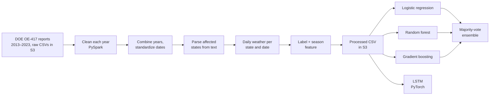

# Weather-Related Power Outage Prediction on Databricks

A PySpark pipeline on Databricks that combines eleven years of U.S. power grid disturbance reports with historical weather data, then trains classification models to predict whether a disturbance was weather-related.

It covers the full workflow on a cloud platform: raw files in AWS S3, multi-year ETL in Spark, API-based weather enrichment, and model training with Spark MLlib and PyTorch.

## How it works



1. **Clean each year.** The data come from DOE Form OE-417 (Electric Emergency Incident and Disturbance Report), published as one annual summary per year. The layout shifts from year to year: column positions move, header and footer rows differ, and dates appear as either `YYYY-MM-DD` or `MM/DD/YYYY`. Each year is cleaned separately in PySpark into one common schema (event start and restoration dates, area affected, NERC region, event type, demand loss in MW, customers affected), with "Unknown" entries set to null.
2. **Combine.** The 11 cleaned years are unioned into one table, dates are standardized, and rows missing an event type or start date are dropped.
3. **Find the states.** The area-affected field is free text and often names more than one state. A PySpark UDF maps it to two-letter state codes and splits multi-state events into one row per state. Rows with no identifiable state are dropped.
4. **Add weather.** For each unique state and date, daily maximum and minimum temperature, precipitation, and wind speed on the day the event began are pulled from a weather API and joined back to the outage records. Querying unique state–date pairs instead of every row keeps the number of API calls down. The notebook includes two versions of this step: NOAA Climate Data Online (GHCN-Daily, state-level, requires a free token) and Open-Meteo's historical archive (state centroid coordinates, no key, requests sent in parallel batches across 10 worker threads).
5. **Label and add features.** `weather_outage` is 1 if the event type mentions weather and 0 otherwise. The month of the event start date is grouped into a season (winter, spring, summer, fall). The processed table is written back to S3 as a single CSV.
6. **Model.** See below.

## Models

The Spark MLlib models (notebooks 2–5) use the same five features (`temp_min`, `temp_max`, `wind_speed`, `precipitation`, `season`) and the same 80/20 train/test split (seed 42). Missing wind speed is set to 0, and rows missing temperature are dropped.

| Notebook | Model | Settings |
|---|---|---|
| 2 | Logistic regression | 10 iterations |
| 3 | Random forest | 100 trees, max depth 5 |
| 4 | Gradient-boosted trees | 100 iterations, max depth 5, learning rate 0.1 |
| 5 | Ensemble | Majority vote of notebooks 2–4: weather-related if at least 2 of 3 models say so |
| 6 | LSTM (PyTorch) | Sequences of 7 events, 1 layer, 32 hidden units, 50 epochs, Adam (lr 0.001) |

The LSTM treats the data as a sequence. It reads seven consecutive events (min-max scaled temperature, wind speed, month, and day of week) and predicts whether the next event is weather-related. Sequences are split in date order, with the first 80% used for training and the last 20% for testing.

Each model reports accuracy, precision, recall, and a confusion matrix. The logistic regression, random forest, and gradient boosting notebooks also report AUC, and they print model coefficients or feature importances.

## Results

<!-- Fill in from the printed output of notebooks 2–6 -->

| Model | Accuracy | AUC | Precision | Recall |
|---|---:|---:|---:|---:|
| Logistic regression | | | | |
| Random forest | | | | |
| Gradient-boosted trees | | | | |
| Ensemble (majority vote) | | — | | |
| LSTM | | — | | |

Precision and recall for the Spark models are weighted averages across both classes. For the LSTM they are reported for the weather-related class only.

## Limitations

- **The models classify causes, not occurrence.** Every row is a disturbance that was reported, so the models learn whether the weather that day separates weather-caused events from events with other causes. Predicting whether an outage will happen at all would require adding days with no outage.
- **Weather is coarse.** Each state gets one reading per day: a single centroid point (Open-Meteo) or the first station NOAA returns for the state. Large states like Texas and California are summarized by one location, and only the day the event began is used.
- **The label is a keyword match.** An event counts as weather-related only if its event type contains the word "weather," so events described with other wording are labeled non-weather.
- **The random split may be optimistic.** A multi-state event becomes several rows with the same date and similar weather, and a random split can place those rows in both the training and test sets. Splitting by event would give a stricter test.
- **Missing wind speed is set to 0,** which treats a missing reading as calm air.

## Running it

The notebooks are Databricks source files (`.py` files with `# COMMAND ----------` cell markers). Import the folder into a Databricks workspace and attach a cluster.

- Run notebook 1, then 1.1. Notebooks 2–6 each read the processed CSV, so after the ETL step they can be run in any order.
- Notebook 1.1 overwrites the processed CSV in place to add the season column.
- Data paths point to the course S3 bucket (`s3://databricks-bucket-ece606/...`). To run this elsewhere, download the OE-417 annual summaries for 2013–2023, upload them to your own storage, and update the paths.
- The Open-Meteo version of the weather step needs no API key. The NOAA version needs a free token from NOAA, which should be stored as a Databricks secret rather than written into the notebook.
- Notebook 6 installs PyTorch with `pip` and also uses scikit-learn and pandas.

## Repository structure

```
weather-outage-prediction-databricks/
├── (Time-Series) ML Algorithm For Weather Outage Prediction/
│   ├── 1 - ETL Processing of Data.py            # clean, combine, parse states, add weather, label
│   ├── 1.1 - Add Additional Feature (Month).py  # season feature
│   ├── 2 - Logistic Regression Model.py
│   ├── 3 - Random Forest Classifier.py
│   ├── 4 - Gradient Boosting Model.py
│   ├── 5 - Ensemble Algorithm.py                # majority vote of notebooks 2–4
│   └── 6 - RNN-LSTM.py                          # PyTorch sequence model
└── README.md
```

## Tools

**Platform:** Databricks, AWS S3
**Python:** PySpark (Spark SQL, MLlib), PyTorch, scikit-learn, pandas, requests
**Data:** DOE Form OE-417, Open-Meteo Historical Weather API, NOAA Climate Data Online

## Data sources

- U.S. Department of Energy, Form OE-417 Electric Emergency Incident and Disturbance Report, annual summaries 2013–2023.
- Open-Meteo Historical Weather API.
- NOAA National Centers for Environmental Information, Climate Data Online (GHCN-Daily).

## Author

**Aaron Pongsugree**, M.S. Biostatistics, George Mason University
[GitHub](https://github.com/aaronpong)
